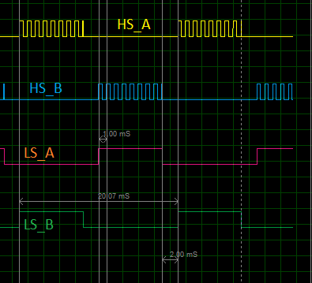

# Single-Phase-Inverter-Algorithm
Single Phase Inverter (H-bridge) algorithm with Atmega328p microcontroller target using cyclic executive approach.

# MCU:
- ATmega328p

# Boards:
- Arduino Uno
- Arduino Nano

# Timing Diagram:


# Tasks:
| Task          | Type     | Execution time (us) | Period = deadtime (ms) | Realease Time (ms) |
| ------------- | -------- | ------------------- | ---------------------- | ------------------ |
| ADC ch0 read  | hardware | 1                   | 1                      | 0                  |
| PWM ch A & B  | hardware | ~0                  | 1                      | 0                  |
| PWM deinit    | software | ~0                  | 10                     | 8                  |
| IO deinit     | software | ~0                  | 10                     | 8                  |
| PWM Update    | software | ~0                  | 10                     | 0                  |
| IO Update     | software | ~0                  | 10                     | 0                  |

### Tick = 1 ms
### major cycle = 10 ms
### CPU utilization ~= 1 %

# Installation:
## Connect your hardware
- HS_A = 9
- HS_B = 10
- LS_A = 11
- LS_B = 12

```C
             _______________
            |               |						
            |               |
    HS_A  |         HS_B  |
            |               |						
            |------LOAD-----|
            |               |						
    LS_A  |         LS_B  |
            |               |						
            |_______________|						
```
## Upload the software
1. Open the Atmel studio project and build the project.
1. Upload the executables onto your target board.
   1. go to tools tap in Atmel Studio
   1. Press external tools
   1. Make an external tool with a name of your choice. The command is "avrdude.exe". 
   
   The Arguments for Arduino UNO: 
   ```C
   -p m328p -c arduino -P COM4 -b 115200  -U flash:w:"$(ProjectDir)Debug\$(TargetName).hex":i 
   ```
   just change the COM4 to your Arduino PORT number.
   
   The Arguments for Arduino UNO:
   ```C
   -p m328p -c arduino -P COM6 -b 57600 -U flash:w:"$(ProjectDir)Debug\$(TargetName).hex":i 
   ```
   just change the COM6 to your Arduino PORT number.
   
   The Arguments for USBasp programmer
   ```C
   -p m328p -c usbasp -U flash:w:"$(ProjectDir)Debug\$(TargetName).hex":i
   ```
   
   Press "Ok"
1. Press external tools again then press on the name of the tool you just created. 

